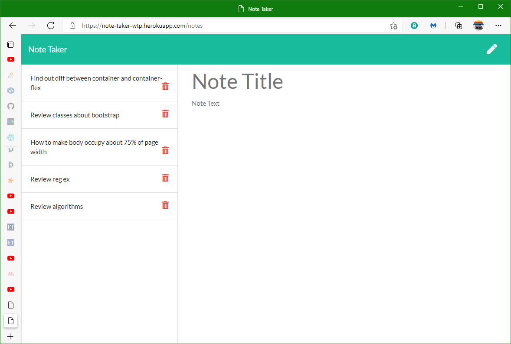

# 11-Note-Taker

## Description
This application, Note-Taker, can be used to write and save notes. The server side is based on Express web framework (Node.js/JavaScript). Notes are saved on the server in a JSON file. If two people or more use this app to save notes, the notes will be mingled together. The app on is deployed on Heroku.com as (https://note-taker-wtp.herokuapp.com/).

## Installation
The GitHub repository for this application is here (https://github.com/minprocess/11-Note-Taker)

Two npm packages need to be installed, Express (https://www.npmjs.com/package/express) (the server) and uuid (https://www.npmjs.com/package/uuid) for generating unique ids for the notes (so two notes with same title and text can be safely deleted)

The functioning website deployed on Heroku is here (https://note-taker-wtp.herokuapp.com/)

## Usage
The notes are stored in a single file, db.json. That means if you use it on Heroku your notes will be mingled with anyone else that uses this app.  
  
Here is a link to a screenshot of the app.  
 
 

## Credits
Trilogy Education, a division of 2U programmed the amazing front end of this app. It served as the starting point for me.
## License
Copyright (c) [2021] [William T Pate]

Permission is hereby granted, free of charge, to any person obtaining a copy
of this software and associated documentation files (the "Software"), to deal
in the Software without restriction, including without limitation the rights
to use, copy, modify, merge, publish, distribute, sublicense, and/or sell
copies of the Software, and to permit persons to whom the Software is
furnished to do so, subject to the following conditions:

The above copyright notice and this permission notice shall be included in all
copies or substantial portions of the Software.

THE SOFTWARE IS PROVIDED "AS IS", WITHOUT WARRANTY OF ANY KIND, EXPRESS OR
IMPLIED, INCLUDING BUT NOT LIMITED TO THE WARRANTIES OF MERCHANTABILITY,
FITNESS FOR A PARTICULAR PURPOSE AND NONINFRINGEMENT. IN NO EVENT SHALL THE
AUTHORS OR COPYRIGHT HOLDERS BE LIABLE FOR ANY CLAIM, DAMAGES OR OTHER
LIABILITY, WHETHER IN AN ACTION OF CONTRACT, TORT OR OTHERWISE, ARISING FROM,
OUT OF OR IN CONNECTION WITH THE SOFTWARE OR THE USE OR OTHER DEALINGS IN THE
SOFTWARE.

---

## Features
The delete note function works
Not multi-user. Can this be made multiuser by putting the notes db.json on the client's PC?
## How to Contribute
I don't want any contributions at this time. Feel free to fork if you want to work on this
[Contributor Covenant](https://www.contributor-covenant.org/)
## Tests
There are no tests for this application
